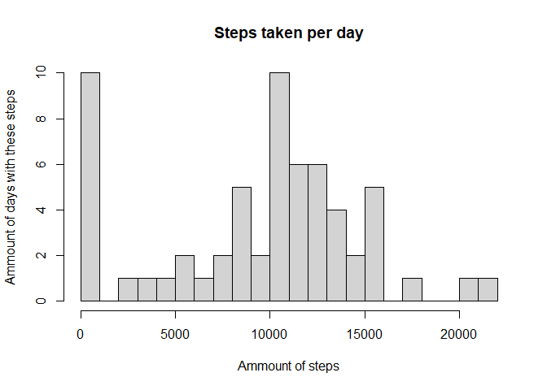
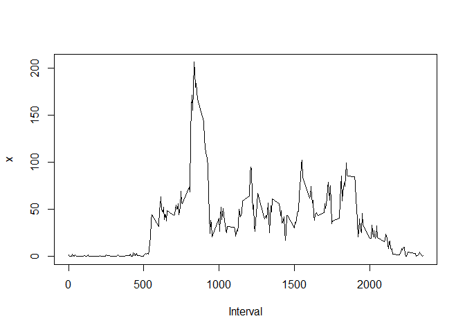
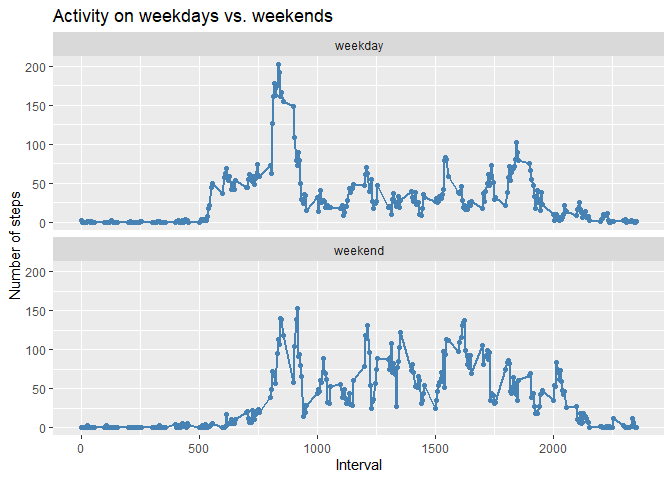

Welcome to my assignment!

## Load necessary libraries


```r
library(dplyr)
```

```
## 
## Attaching package: 'dplyr'
```

```
## The following objects are masked from 'package:stats':
## 
##     filter, lag
```

```
## The following objects are masked from 'package:base':
## 
##     intersect, setdiff, setequal, union
```

```r
library(ggplot2)
```

```
## Warning: package 'ggplot2' was built under R version 4.0.5
```

## Loading and preprocessing the data


```r
unzip('activity.zip')
data <- read.csv('activity.csv')
data <- mutate(data, date=as.Date(data$date, format = "%Y-%m-%d"))
```

## What is mean total number of steps taken per day?

Create histogram of total number of steps taken per day.

```r
totalSteps = with(data, aggregate(steps, by=list(Date=date), FUN=sum, na.rm=TRUE))
hist(totalSteps$x, breaks = 20, main = "Steps taken per day", xlab = "Ammount of steps", ylab = "Ammount of days with these steps")
```

<!-- -->

Calculate mean and median of steps taken per day.

```r
mean(totalSteps$x)
```

```
## [1] 9354.23
```

```r
median(totalSteps$x)
```

```
## [1] 10395
```

## What is the average daily activity pattern?

Create time series plot of average activity across the day.

```r
averageSteps <- with(data, aggregate(steps, by=list(Interval=interval), FUN=mean, na.rm=TRUE))
plot(averageSteps, type = 'l')
```

<!-- -->

Which 5-minute interval contains the maximum number of steps

```r
averageSteps[["Interval"]][averageSteps$x == max(averageSteps$x)]
```

```
## [1] 835
```

## Imputing missing values

Total number of missing values.

```r
sum(is.na(data$steps))
```

```
## [1] 2304
```

Strategy to fill in missing values: Replace NAs with 0.

Create new dataset with missing data filled in.

```r
data2 <- data
data2[["steps"]][is.na(data2$steps)] <- 0
```

Create histogram of total number of steps taken per day.

```r
totalSteps2 = with(data2, aggregate(steps, by=list(Date=date), FUN=sum))
hist(totalSteps2$x, breaks = 20, main = "Steps taken per day", xlab = "Ammount of steps", ylab = "Ammount of days with these steps")
```

<!-- -->

Calculate mean and median of steps taken per day.

```r
mean(totalSteps2$x)
```

```
## [1] 9354.23
```

```r
median(totalSteps2$x)
```

```
## [1] 10395
```

### Conclusion

This tactic has no effect to the daily number of steps because the days were calculated with 0 steps before already.
That's also why the histogram looks the same as before.
Other tactics to fill missing values could have an impact to the resulting diagram. If you take e.g. always the average of this time interval you would have many days with average steps per day and fewer with 0 steps.


## Are there differences in activity patterns between weekdays and weekends?

Create a factor variable whether a day is weekday or weekend.

```r
data2$wday <- factor(weekdays(data2$date) == "Saturday" | weekdays(data2$date) == "Sunday", labels = c("weekday", "weekend"))
```

Create panel plot for the data

```r
par(mfrow=c(2,1))
averageSteps2 <- with(data2, aggregate(steps, by=list(Interval=interval, Weekday=wday), FUN=mean))
ggplot(data=averageSteps2, aes(Interval, x)) +
     geom_line(color = "steelblue", size = 1) +
     geom_point(color="steelblue") +
     facet_wrap(~Weekday, dir = "v") +
     labs(title = "Activity on weekdays vs. weekends", y = "Number of steps", x = "Interval")
```

<!-- -->

